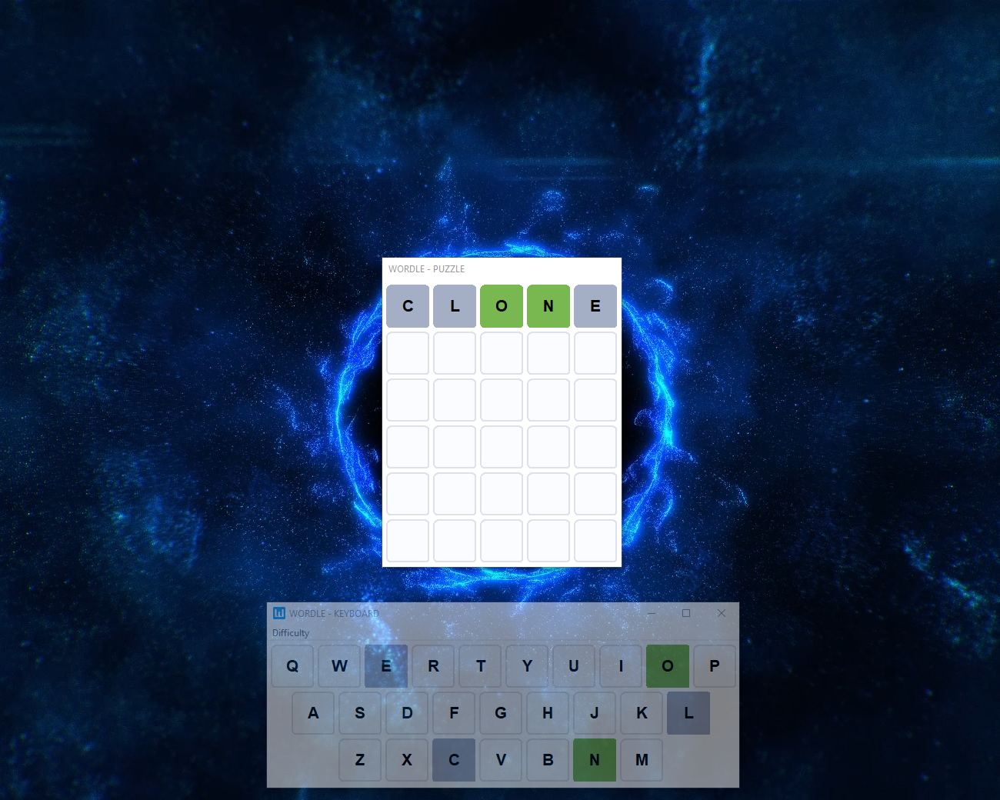
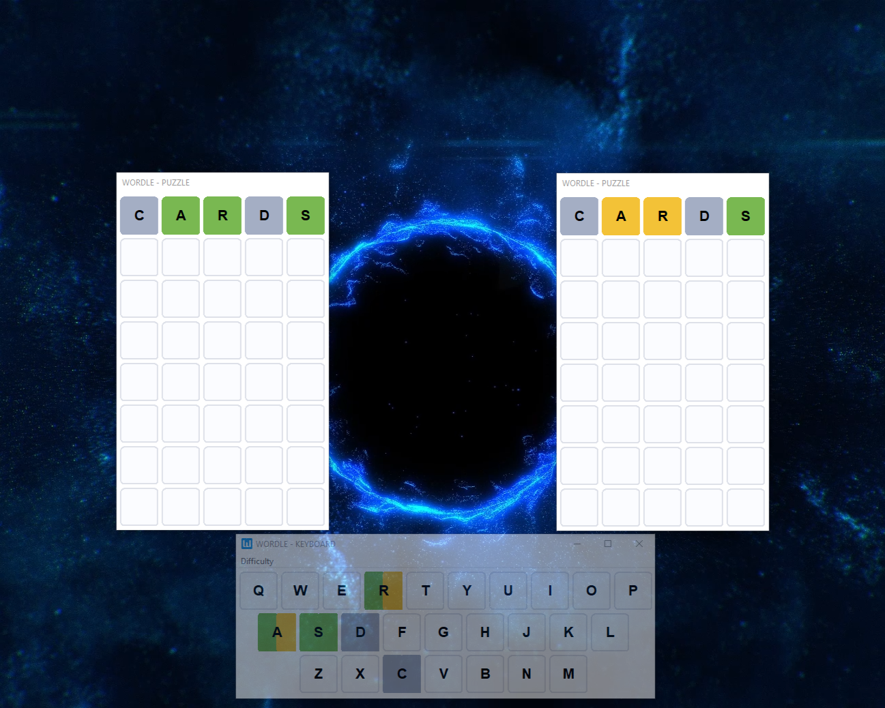
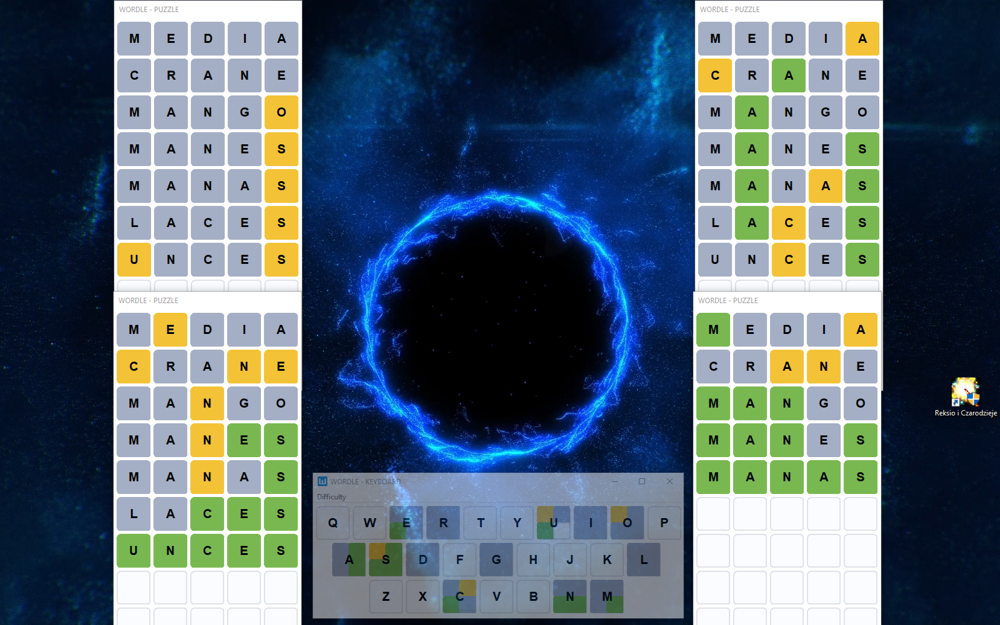

# Desktop Wordle / Dordle / Quordle Clone
Project made as an assignment for Programming In Graphical Environment class at Warsaw University of Technology, 2023.

## Description
This is a desktop Wordle clone with 3 different difficulties to choose. You can solve one, two or even four Wordles at once!

### Easy

### Medium

### Hard
